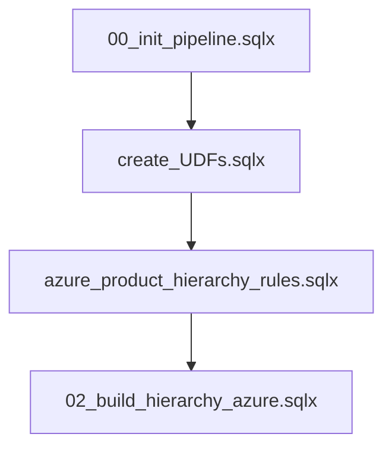

# Azure Product Taxonomy & Classification Engine Design Document

## 1. Executive Summary
This document outlines the architecture, design decisions, and implementation mechanics of the Azure Product Taxonomy and Classification Engine developed for the Cloud Cost Management Toolkit. The system classifies raw, high-cardinality Azure billing lines into a standardized 8-level business taxonomy framework (from general categories down to individual usage modes). 

To balance business reporting agility with database execution speed, the architecture implements a **Hybrid Taxonomy Strategy**:
* **Levels 2 and 3 (Soft-Coded):** Processed dynamically via a declarative JSON rules schema and a BigQuery JavaScript User Defined Function (UDF) engine.
* **Levels 4 through 8 (Hard-Coded / Analytical):** Sourced through high-performance, native BigQuery SQL patterns, regex-capturing string extractors, and target character normalizations.

---

## 2. Dynamic Rules Engine Architecture (L2 & L3 Classification)

To eliminate the need for massive, static SQL queries that require structural changes whenever business requirements pivot, the core classification layer is fully soft-coded. 

### 2.1 The Rules Schema (`azure_product_hierarchy_rules`)
Rules are defined as rows in a declarative rules table. The engine supports a rich taxonomy classification pattern where rules carry priorities and level indicators:

| Column | Type | Description |
| :--- | :--- | :--- |
| `hier_level` | `INT64` | The target level (2 for L2 Category, 3 for L3 Subcategory). |
| `priority` | `INT64` | The precedence of the rule (lower numbers execute first). |
| `parent_l2` | `STRING` | For L3 rules, defines the parent L2 category this sub-rule belongs to. |
| `output_value` | `STRING` | The standard taxonomics classification output to set on match. |
| `conditions_json` | `STRING` | A JSON-string containing the logical conditions required to trigger a match. |

### 2.2 Declarative JSON Condition Operators
The JavaScript UDF parsing engine reads and interprets the boolean logic nested inside `conditions_json`. The syntax supports advanced nested rules, including logical combinations:

* **Logical Gateways:** `AND`, `OR`, `NOT`
* **Relational Operators:**
  * `=` (Exact match)
  * `!=` / `<>` (Inequality)
  * `IN` (Set membership)
  * `NOT IN` (Set exclusion)
  * `LIKE` (Sub-string check)
  * `NOT LIKE` (Sub-string exclusion)
  * `REGEX_CONTAINS` (Case-insensitive Regular Expression check)
  * `NOT REGEX_CONTAINS` (Negated Regular Expression check)
  * `IS_TRUE` / `IS_FALSE` (Boolean check)
  * `IS_NULL` / `IS_NOT_NULL` (Existence check)

#### Example: Dynamic L2 Networking Rule
```json
{
  "op": "OR",
  "clauses": [
    {
      "field": "consumed_service",
      "op": "IN",
      "values": ["MICROSOFT.NETWORK", "MICROSOFT.CDN", "MICROSOFT.FRONTDOOR"]
    },
    {
      "field": "meter_category",
      "op": "IN",
      "values": [
        "VIRTUAL NETWORK", "BANDWIDTH", "LOAD BALANCER", "VPN GATEWAY", 
        "APPLICATION GATEWAY", "EXPRESSROUTE", "AZURE FRONT DOOR SERVICE", 
        "CONTENT DELIVERY NETWORK"
      ]
    },
    {
      "field": "meter_sub_category",
      "op": "REGEX_CONTAINS",
      "values": ["DATA TRANSFER"]
    }
  ]
}
```

### 2.3 The UDF Engine (`EvaluateRule`)
The classification engine resides inside a safe-sandboxed, multi-statement BigQuery JavaScript User Defined Function (UDF). It receives the active billing row attributes and the rule's `conditions_json` string, compiling them at runtime.

* **Automatic Case-Insensitivity:** To protect against cloud provider case drift, the UDF automatically casts all compared values and strings to uppercase before running set, exact, or text matches.
* **Format-Safe Parsing:** If a rule targets a field that is undefined or null on a given billing row, the UDF handles it safely and gracefully returns `false` (or matches `IS_NULL`), preventing runtime query failure.

---

## 3. The Null-Safe BigQuery Join Pattern (`row_id` Architecture)

During technical validation on diverse datasets, a critical BigQuery-specific join constraint was discovered and resolved.

### 3.1 The Problem: The `NULL = NULL` Join Barrier
The original pipeline joined the classified best-match tables back to the main dataset using a massive multi-column key:
```sql
LEFT JOIN L2_BestMatch bm USING (
  meter_category, meter_sub_category, meter_name, meter_region,
  consumed_service, publisher_name, tag__deployment, plan_name,
  unit_of_measure, pricing_model, term
)
```
* **SQL Constraint:** According to ANSI SQL standards, `NULL = NULL` is evaluated as `UNKNOWN` (falsy). 
* **The Breakpoint:** For commitment purchases (where columns like `term` hold `"12"` or `"36"`), the join succeeded. However, for standard non-commitment on-demand lines, the `term` column is `null`. The database rejected the equijoin on these rows, silently throwing out the successful matches and falling back to a default value of `'Others'`.

### 3.2 The Solution: Deterministic Single-Key `row_id` Joins
To guarantee 100% join safety for data containing null values, the architecture introduces a **Deterministic Surrogate Row Key Pattern**:

1. **Analytical Row Generation:** In the initial aggregations CTE (`DataForUDF`), a fast sequential integer key is generated using a BigQuery analytic partition:
   ```sql
   ROW_NUMBER() OVER () AS row_id
   ```
2. **Single-Column Integer Joins:** All dynamic rule matching, priority ranking, and subsequent classifications are performed on this non-null, high-performance integer key instead of multi-column sets:
   ```sql
   LEFT JOIN L2_BestMatch bm ON bm.row_id = d.row_id
   ```
   This single key join eliminates all null-value comparison errors, dramatically simplifies the internal query execution plan, and increases throughput.

---

## 4. The Hybrid Taxonomy Strategy (Architectural Decision Record)

A key architectural decision was made to leverage a **hybrid model** dividing responsibilities between declarative rules (L2/L3) and native SQL operations (L4-L8).

### 4.1 Comparison & Separation of Concerns

| Attribute / Level | L2 & L3 Classification | L4 to L8 Dynamic Detail & Extraction |
| :--- | :--- | :--- |
| **Primary Method** | Declarative Rules Table + JS UDF | Native BigQuery SQL `CASE-WHEN` Statements |
| **Logic Type** | Soft-Coded JSON Conditions | Hard-Coded Regular Expressions & Analytics |
| **Goal** | Strategic Category Clustering | Dynamic Extraction, Text-Cleaning & Normalization |
| **Change Frequency** | High (Business Reporting Requirements) | Low (Technical String Formats of Logs) |

### 4.2 Rationale for Keeping L4-L8 Native
1. **Dynamic Substring Extractions (Capture Groups):** L4-L8 queries are not simple boolean triggers. They actively retrieve dynamic substrings from billing labels and parse high-cardinality targets (e.g., extracting `'DSV5'` from `'Dsv5 Series'` or identifying vendor chip types like `'Arm'` or `'Intel'`). Moving this dynamic extraction logic into a rules database would require complex dynamic regex substitution variables, compromising maintainability.
2. **Format Normalization & Text-Cleaning:** Lower-level details require raw operational cleanup, such as stripping non-breaking spaces (`CHR(160)`) and formatting vendor names. These low-level manipulations are highly suited for native BigQuery optimization.
3. **Execution Speed:** Processing dynamic string parsing and high-cardinality analytics inside BigQuery's native SQL processing engine is orders of magnitude faster than pushing complex variable evaluations through a sandboxed JavaScript runtime environment.

---

## 5. Pipeline Reference Guide

### 5.1 Deployment Sequence
To trigger the compiled categorization sequence within a Dataform environment, actions must be executed in order:



1. **`00_init_pipeline.sqlx`**: Establishes schema environments, configuration variables, and source tables.
2. **`create_UDFs.sqlx`**: Builds the custom logical rules processor `EvaluateRule` in your dataset variables environment.
3. **`azure_product_hierarchy_rules.sqlx`**: Seeds your active workspace's database taxonomy rules table (68 base rules).
4. **`02_build_hierarchy_azure.sqlx`**: Runs the partition-backed `row_id` surrogate join engine, evaluates dynamic L2/L3 categories, runs analytical L4-L8 extractions, and materializes the target dataset.
